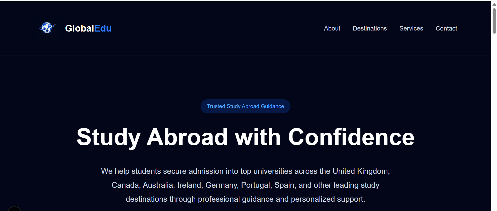
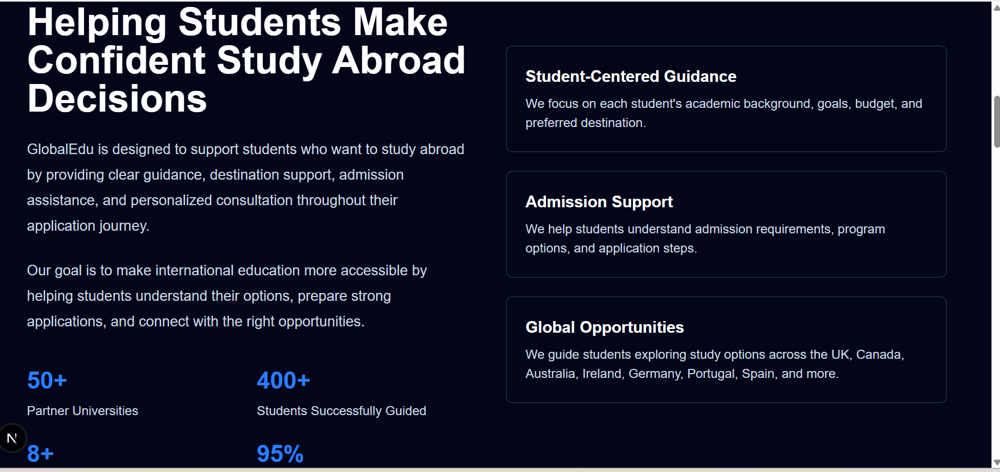
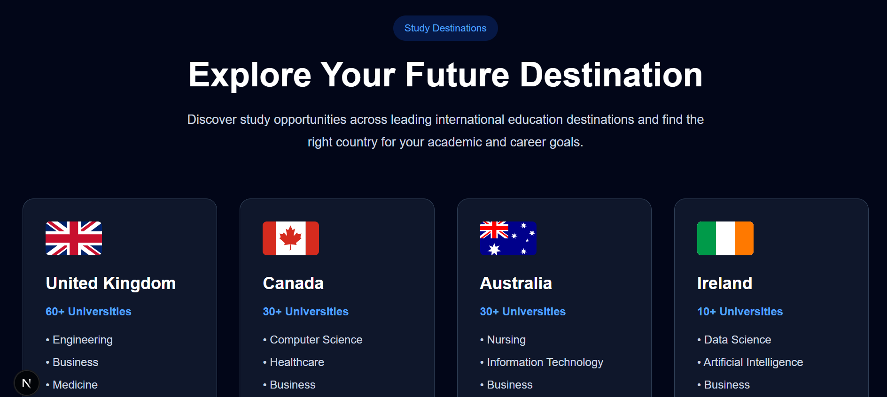
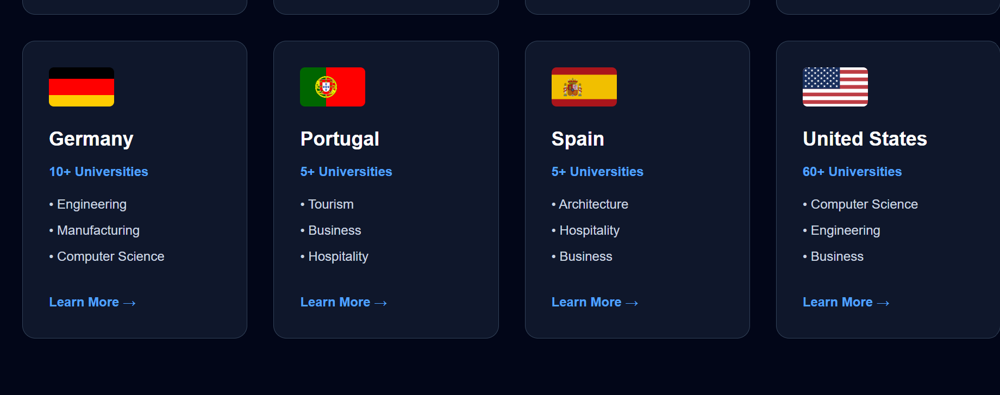
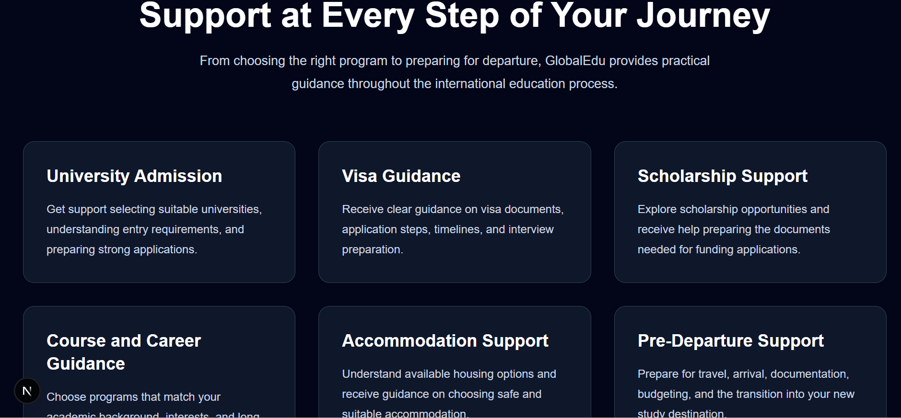

<div align="center">

# 🌍 GlobalEdu

### **Global Education Platform**

*A modern, responsive, and type-safe study abroad consultancy platform built with Next.js 15, React 19, TypeScript, and Tailwind CSS. Designed with scalability and future backend integration in mind.*


---


</div>

---

# 📖 Project Overview

GlobalEdu is a web application platform engineered for **Global Education Overseas Studies Limited**, an international education consultancy that assists students in pursuing academic opportunities abroad.

The platform provides a digital portal where prospective students can explore study destinations, discover consultancy services, and request personalized guidance through an intuitive consultation system.

This repository contains the full frontend implementation and is architected specifically for upcoming REST API backend and database integration.

---

# ✨ Core Features

- 🌍 **Responsive Landing Interface:** Mobile-first layout designed with Tailwind CSS utilities.
- 🧭 **Smooth Component Navigation:** Dynamic, accessible navigation bar with seamless scroll handling.
- 🎯 **Interactive Hero Section:** Clear value proposition and primary Call to Action (CTA).
- 🌎 **Destination Showcase:** Grid-based presentation of study destinations with country asset badges.
- 💼 **Services Directory:** Core agency packages organized into modular, reusable UI components.
- 📝 **Consultation Form:** Interactive intake form setup ready for API payload submission.
- ⚡ **Optimized Asset Pipeline:** Next.js `Image` optimization for fast rendering and zero Cumulative Layout Shift (CLS).

---

# 📸 Application Preview

Explore the modern, responsive user interface of the GlobalEdu platform.

---

## 🏠 Landing Page

The homepage introduces GlobalEdu with a clean navigation experience, strong branding, and a clear call to action for prospective international students.



---

## 👥 About GlobalEdu

The About section highlights the platform's mission, student-focused approach, and key value propositions.



---

## 🌍 Study Destinations

Students can explore leading international study destinations through a responsive and visually engaging interface.



---

## 🎓 Destination Cards

Each destination provides information about available universities and popular academic programs.



---

## 💼 Student Services

GlobalEdu offers guidance on university admissions, visa applications, accommodation, scholarships, career planning, and pre-departure support.



---

## 📝 Consultation Request Form

Students can submit their study preferences through an interactive consultation form designed for future backend API integration.


# 🧠 Architectural Decisions

GlobalEdu was engineered as an extensible frontend application rather than a static template. Every decision prioritizes type safety, component decoupling, and backend integration readiness.

### 🛡️ End-to-End Type Safety (TypeScript)
- End-to-end interface definitions across all components and props to catch errors at compile-time.
- Strongly typed form payloads ready to serve as contract specifications for future REST endpoints.

### 🧩 Modular Component Architecture
- UI components (Hero, Nav, Form, Cards) are isolated in `/app/components/` to enforce single-responsibility principles.
- Clean separation between Server Components (for fast layout load) and Client Components (`'use client'` for form interaction).

### ⚡ Performance & Scalability
- Optimized images via Next.js `Image` API to enforce aspect ratios and WebP conversion.
- Utility-first styling via Tailwind CSS to ensure zero runtime CSS footprint.

---

# 🛠️ Tech Stack

| Layer | Technology | Engineering Purpose |
|--------|------------|---------|
| **Framework** | Next.js 15 (App Router) | Server-driven rendering, routing, and route handler management |
| **UI Engine** | React 19 | Declarative user interface development |
| **Language** | TypeScript | Compile-time safety and self-documenting codebases |
| **Styling** | Tailwind CSS | Mobile-first responsive design with zero runtime overhead |
| **Optimization** | Next.js Image | Automated asset optimization and lazy loading |
| **Version Control** | Git & GitHub | Feature branching, semantic commits, and versioning |

---

# 📁 Project Structure

```text
global-education-platform/
├── app/
│   ├── components/     # Decoupled UI modules (Nav, Hero, Forms, Cards)
│   ├── globals.css     # Tailwind imports and custom rules
│   ├── layout.tsx      # Root application shell & metadata
│   └── page.tsx        # Composition root for landing view
├── public/
│   ├── flags/          # Country flag assets
│   ├── globaledu-icon.png
│   └── favicon.ico
├── package.json
├── tsconfig.json
└── README.md

## 🚀 Getting Started

Follow these steps to run the project locally on your machine.

### Prerequisites
* **Node.js**: v18.0.0 or higher
* **npm** or **yarn**

### Installation

1. **Clone the repository:**
   ```bash
   git clone [https://github.com/loveamarachicloud/global-education-platform.git](https://github.com/loveamarachicloud/global-education-platform.git)

2. Navigate into the project directory
cd global-education-platform
3. Install dependencies
npm install
4. Execute local development server
npm run dev
Open http://localhost:3000 in your browser to view the application.

# 🗺️ Roadmap & Sprint Objectives

### ✅ Phase 1: Frontend Architecture (Completed)
- [x] Responsive layout with Tailwind CSS
- [x] Component modularity via Next.js 15 App Router
- [x] Form setup with client-side state handling & typing
- [x] Technical documentation & architectural decision records

### 🚧 Phase 2: Backend & Database Integration (In Progress)
- [ ] Implement RESTful Route Handlers (`/api/consultations`)
- [ ] PostgreSQL schema design & ORM integration (Prisma)
- [ ] Automated transactional email delivery pipeline (Resend API)

### 🔜 Phase 3: DevOps, Containerization & Production Deployment
- [ ] **Containerization:** Multi-stage `Dockerfile` optimization to minimize image footprint and standard production environments.
- [ ] **Orchestration:** `docker-compose.yml` for unified local setup powering application and PostgreSQL containers.
- [ ] **CI/CD Automation:** GitHub Actions workflow executing build checks, TypeScript compilation, and linting on every Pull Request.
- [ ] **Infrastructure & Hosting:** Automated production deployment pipeline targeting AWS (ECS / App Runner) or Vercel with environment variable security.
- [ ] **Observability:** Health-check endpoint (`/api/health`) and application log aggregation.

# 🏢 Project Ownership & Engineering Context

* **Client / Domain:** Global Education Overseas Studies Limited
* **Engineering Scope:** Full-Stack Web Application Architecture
* **Implementation Status:** Active Full-Stack Sprint (Frontend Phase Complete | Backend In Progress)

This repository represents the primary technical implementation for the GlobalEdu web platform. All software architecture, Next.js routing, modular component systems, and technical documentation are independently engineered and maintained by the author below as part of an active end-to-end build sprint.

# 👨‍💻 About the Engineer

**Love**  
*Backend & Full-Stack Software Engineer* — Lisbon, Portugal  

> **Engineering Mindset:** Bridging 10 years of IT operations and system reliability experience with modern software engineering. Focused on building type-safe REST APIs, structured database schemas, containerized environments, and clean full-stack systems.

### 🛠 Core Technical Stack
* **Languages & Runtimes:** TypeScript, JavaScript (Node.js), SQL, HTML5/CSS3
* **Frameworks & Libraries:** Next.js (App Router), React 19, Express.js, Tailwind CSS
* **Database & ORM:** PostgreSQL, Prisma ORM
* **DevOps & Infrastructure:** Docker, Git/GitHub, Linux/Unix System Administration, CI/CD, RESTful API Design

---

### 🌐 Connect & Code

- **GitHub:** [loveamarachicloud](https://github.com/loveamarachicloud)
- **LinkedIn:** [Love Amarachi Onyekwere](https://www.linkedin.com/in/love-amarachi-onyekwere-0423bb67)
- **Location:** Lisbon, Portugal
- **Open to:** Local, Hybrid, and Remote Opportunities

---

<div align="center">

Built with Next.js, TypeScript & Tailwind CSS by **Love**

</div>

# 📌 Usage Notice

This repository is shared as part of my professional software engineering portfolio.

It showcases the frontend architecture, implementation, and engineering practices developed for **Global Education Overseas Studies Limited (GlobalEdu)**.

The project is intended for demonstration and educational purposes. If you would like to reuse or build upon substantial portions of this work, please contact the author for permission.